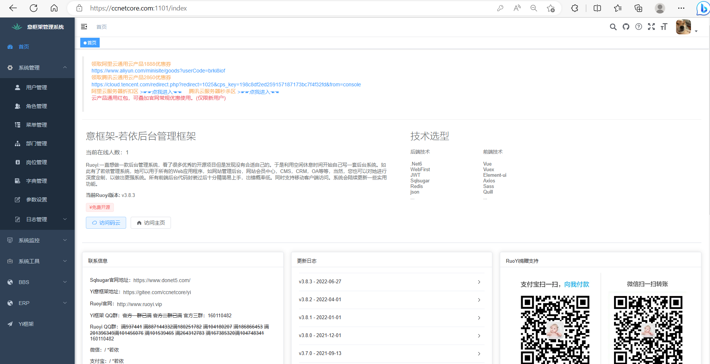
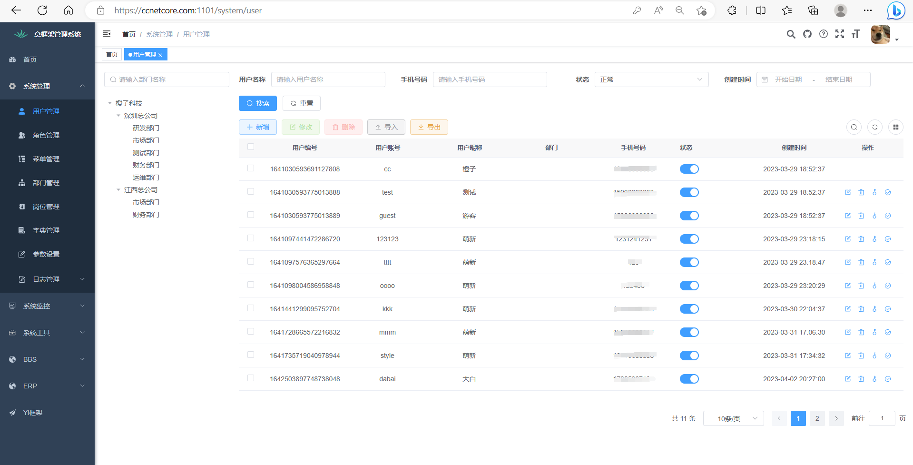
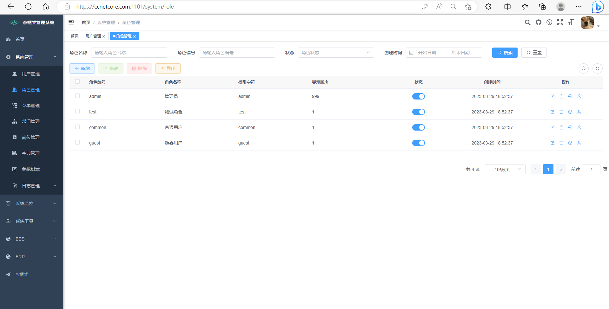
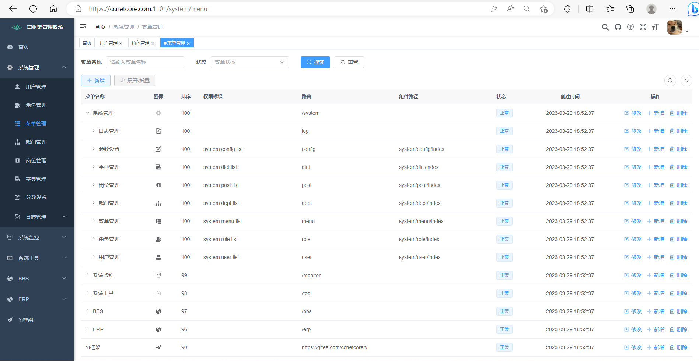
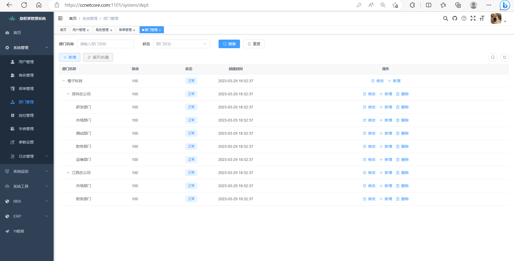
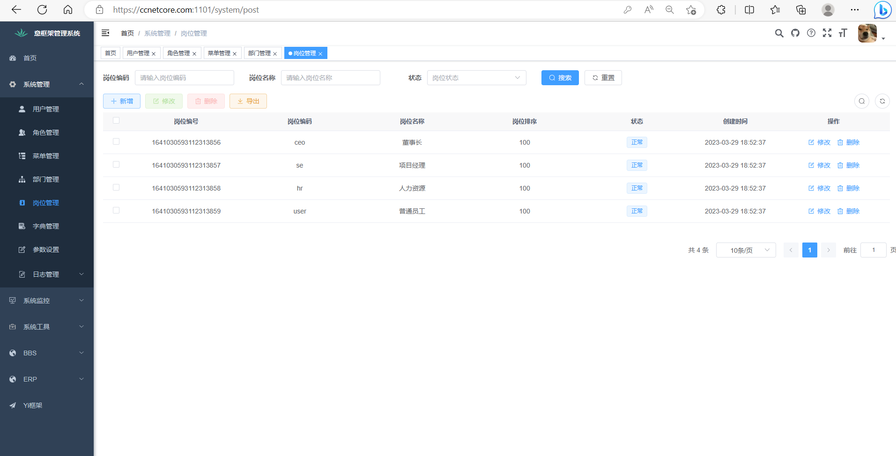
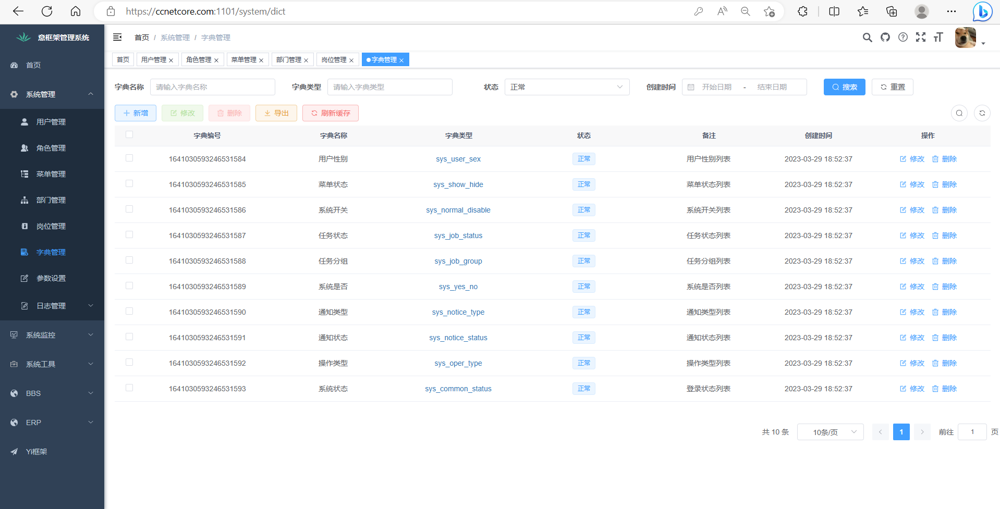
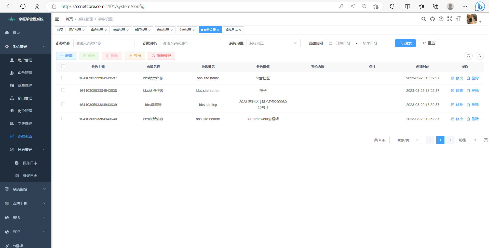
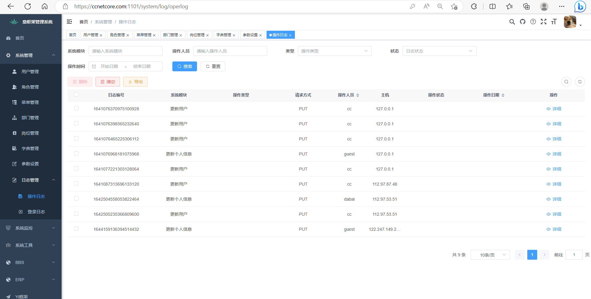

<h1 align="center"> Yi框架</h1>
<h4 align="center">一套以用户体验出发的.Net6 Web开源框架</h4>
<h2 align="center">集大成者，终究轮子</h2>

[English](README-en.md) | 简体中文

****
### 简介:
**中文：意框架**（和他的名字一样“简易”，同时接入Java的Ruoyi Vue3.0前端）

模块分化较多，可根据业务自行引用或抛弃，集大成者，大而全乎，也许你能从中学习到一些独特见解

**英文：YiFramework**

Yi框架-一套与SqlSugar一样爽的.Net6开源框架。
与Sqlsugar理念一致，以用户体验出发。
适合.Net6学习、Sqlsugar学习 、项目二次开发。
集大成者，终究轮子

Yi框架最新版本标签：`v3.0.0`，具体版本可以查看标签迭代

（项目与Sqlsugar同步更新，但这作者老杰哥代码天天爆肝到凌晨两点，我们也尽量会跟上他的脚步。更新频繁，所以可watching持续关注。）

————这不仅仅是一个程序，更是一个艺术品，面向艺术的开发！

> 核心特点：简单好用，框架不以打包形式引用，而是直接以项目附带源码给出，自由度拉满，遵循Mit协议，允许随意修改（请注明来源即可）

**分支：**

（本项目由EFCore版本历经3年不断迭代至Sqlsugar版本，现EFcore版本已弃用，目前sqlsugar已带业务功能）

- **Framework**: 框架分支，所有东西都在这里

- ~~**SqlSugar**:.Net6 DDD领域驱动设计 简单分层微服务架构~~

- ~~**SqlSugar-Dev**：为sqlsugar分支的实时开发版本~~

- ~~**ec**: EFcore完整电商项目~~

****

### 演示地址：

废话少说直接上地址，**请不要**更改里面的数据

官网网址：[ccnetcore.com](https://ccnetcore.com)  (已上线，欢迎加入)

Bbs社区系统：[ccnetcore.com](https://ccnetcore.com)  (已上线，欢迎加入)

Rbac后台管理系统：[yi.ccnetcore.com](http://yi.ccnetcore.com)    (已上线)~~管理员账号：cc 、 123456~~

网关地址：~~[gate.ccnetcore.com/swagger](http://gate.ccnetcore.com/swagger)~~(目前使用单体架构)

### 支持:

- [x] 完全支持单体应用架构
- [x] 完全支持分布式应用架构
- [x] 完全支持微服务架构
- [ ] 即将支持网格服务架构（我们将在后续版本加入dapr）

****
### 详细到爆炸的Yi框架教程导航：

1. [框架快速开始](https://ccnetcore.com/article/1641733850189139969)(已完成)
2. [框架模块教程](https://ccnetcore.com/article/1641733991574933505)(已完成)
3. [应用模块教程](https://ccnetcore.com/article/1641734073091231745)
4. [Yi.RBAC后台系统](https://ccnetcore.com/article/1641734171128893441)
5. [Yi.BBS社区系统](https://ccnetcore.com/article/1641734308475572225)

****
### 它的理念:
优雅的进行快速开发，通常，简单程度与优雅程度不可兼得，Yi框架并不一昧的追求极致的解耦，会站在用户使用角度上，在使用难易度进行考虑衡量

例如：我们大部分功能紧密贴合Sqlsugar，虽然缺少其他orm的替换性，但在使用程度上降低的使用难度

例如：我们在应用层中使用属性注入，虽然依赖关系会比较模糊，但是使用起来会减少一定代码量

> 一个面向用户的快速开发后端框架

在真正的使用这，你会明白这一点，极致的简单，也是优雅的一种体现。
****

### 特点:
- 面向用户的后端框架，使用简单，适合小型、企业级项目
- 项目内置源码，不打包
- 开箱即用
- 支持模块化
- 支持动态Api
- 支持属性注入
- 内置包含大量通用场景模块
- 等等

### 基础设施简介
- Jwt鉴权
- 接口级别授权
- 对象映射
- O/RM
- 数据过滤
- 多租户
- 逻辑删除
- 审计日志
- 种子数据
- 工作单元
- 模块化
- 动态Api
- 属性注入
- 自动依赖注入
- 当前用户
- 仓储
- Crud

### 内置模块简介
- 后台任务
- 本地缓存
- 分布式缓存
- 事件总线
- 字典管理
- 文件管理
- 图片操作
- Excel操作
- 操作日志管理
- Sms短信
- 微信支付
- 模板代码生成

### 业务项目
- RABC后台管理系统
- BBS社区系统

> 重复的东西，无需再写一遍，这也是优雅的体现之一

****
### 核心技术
#### 后端
C# Asp.NetCore 6.0
- [x] 动态Api：Cike.AutoApi
- [x] 鉴权授权：Jwt
- [x] 日志：Nlog
- [x] 模块化：StartupModules
- [x] 依赖注入：Autofac
- [x] 对象映射：Mapster
- [x] ORM:SqlsugarCore
- [x] 多租户：Abp
- [x] 后台任务：Quartz.Net
- [x] 本地缓存：MemortCache
- [x] 分布式缓存：CSRedisCore
- [x] 事件总线：Cike.EventBus
- [x] 图像操作：SixLabors.ImageSharp
- [x] Excle操作：ExcelToObject.Npoi

#### 前端
js Vue3.2
- [x] 异步请求：axios
- [x] 图表：echarts
- [x] ui：element-plus
- [x] 存储：pinia
- [x] 路由：vue-router
- [x] 打包：vite

#### 运维
- [x] 部署：nginx
- [x] CICD：gitlab+Jenkins
- [x] Docker：harbor

****
### 业务支持模块：  

RABC权限管理系统（正在更新）
（采用ruoyi前端）
- 用户管理
- 角色管理
- 菜单管理
- 部门管理
- 岗位管理
- 字典管理
- 参数管理
- 用户在线
- 操作日志
- 登录日志
- 等等

 **演示截图：** 

BBS论坛系统（持续迭代）
- 文章管理
- 评论管理
- 主题管理
- 板块管理
- 点赞管理
- 等等

ERP进销存系统（正在更新）
- 供货商管理
- 等等

SHOP电商系统（持续迭代）
- SPU管理
- SKU管理
- 商品规格
- 商品分类
- 等等

****
### 感谢：

**大力支持**： Eleven神、Sqlsugar上海杰哥、Gerry、哲学的老张

[橙子]https://ccnetcore.com

[lzw]https://github.com/yeslode

[朝夕教育]https://www.zhaoxiedu.net

[Sqlsugar]https://www.donet5.com/Home/Doc

[RuYiAdmin]https://gitee.com/pang-mingjun/RuYiAdmin

[ZrAdminNetCore]https://gitee.com/izory/ZrAdminNetCore

****
### 联系我们：

作者QQ：`454313500`，2029年之前作者24小时在线，时刻保持活跃更新。

QQ交流群：官方一群（已满）、官方二群（已满）、官方三群：`786308927`（加作者QQ后同意）

联系作者，这里人人都是顾问

官方网址留言区：[ccnetcore.com](https://ccnetcore.com) 

****
### FQA:

前往官网查看留言区

[留言区](https://ccnetcore.com/discuss/1641030787056930818)